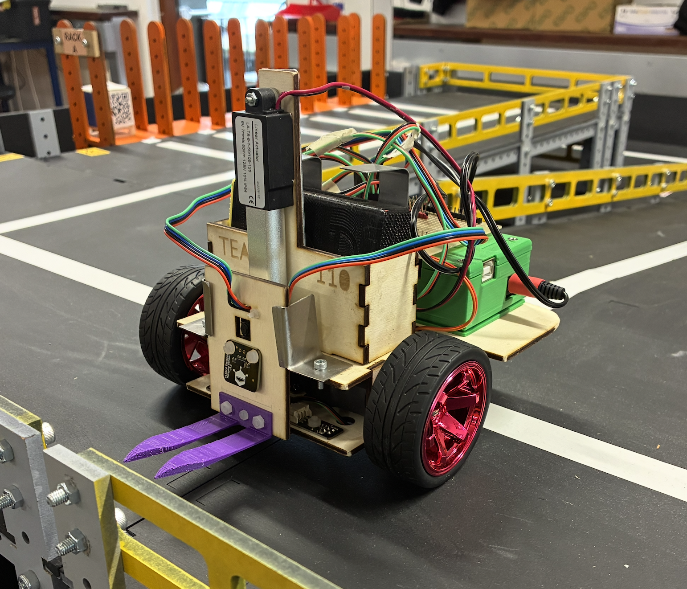
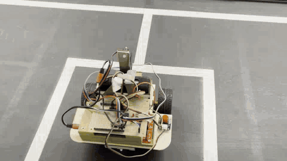
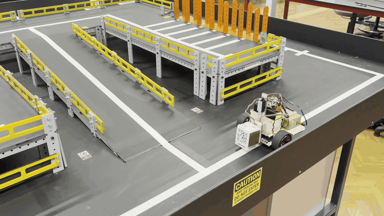
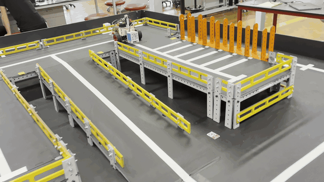
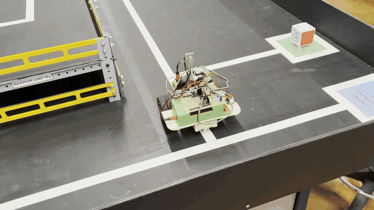
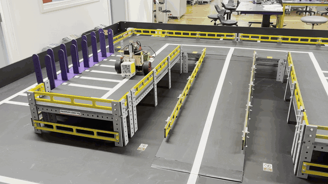

# Autonomous Forklift Robot

**Cambridge Engineering — IDP Team 110**

An autonomous forklift robot developed to collect boxes from loading
bays, read their QR-encoded destinations, navigate a junction-based track,
and unload them at specified rack locations.

<p align="center">

</p>

## Full Autonomous Operation

<p align="center">

</p>
<p align="center">
<em>Full autonomous run shown at 10× speed.</em>
</p>

<p align="center">
<strong><a href="media/full_operation.MOV">Watch the original full-length video</a></strong>
</p>

The full run is driven by a continuously updated list of movement
commands. `main.py` starts the robot with an initial route to the first
loading bay:

``` python
directions = ["ST", "LT", "IG", "LT", "LD", "RO"]
follow_junction(directions)
```

`follow_junction.py` then executes these commands while reading the line
sensors, junction sensors, VL53L0X distance sensor and QR-code reader.
When the robot reaches a loading bay, the `LD` routine approaches the
box, reads its QR code, calls `navigation_moves()` to append the route
to the required rack, lifts the box and reverses out. The robot then
follows the generated route, unloads the box and continues towards the
next loading bay.

## My Contribution

My responsibility in this team project was **software development**. The
mechanical and electrical systems were developed by other members of the
team.

My software work covered:

- autonomous task execution and sequencing;
- line following and junction detection;
- left/right turns, junction ignoring and 180° rotation;
- QR-code reading and destination interpretation;
- dynamic route generation between loading bays and rack locations;
- VL53L0X distance sensing for final box approach;
- drive-motor and linear-actuator control;
- autonomous pickup and upper/lower rack drop-off logic.

## Software Architecture

``` text
main.py
   |
   v
follow_junction.py
   |
   +-- line_follow.py        Line tracking and correction
   +-- navigation.py         QR-based route generation
   +-- motor.py              Drive-motor interface
   +-- actuator.py           Fork lifting/lowering control
   |
   +-- libs/
       +-- VL53L0X/          Distance-sensor driver
       +-- tiny_code_reader/ QR-reader driver
```

`main.py` handles startup and the initial command sequence.
`follow_junction.py` is the main execution layer: it reads the sensors
and executes the current movement command. `line_follow.py` keeps the
robot on the white track, while `navigation.py` converts each QR
destination into the subsequent sequence of junction and
loading/unloading commands.

## Autonomous Operation

### 1. Line Following and Junction Navigation

<p align="center">

</p>
<p align="center">
<em>Straight-line following and rotation at 2× speed.</em>
</p>

<p align="center">
<strong><a href="media/straightline_and_rotate.MOV">Watch the original full-length video</a></strong>
</p>

<p align="center">

</p>
<p align="center">
<em>Ignoring junctions at 2× speed.</em>
</p>

<p align="center">
<strong><a href="media/ignoring_junctions.MOV">Watch the original full-length video</a></strong>
</p>

Two line sensors are used to keep the robot on the white line. A sensor
reads `1` on white and `0` on black. If one sensor leaves the line,
`line_follow.py` drives only the opposite-side motor until the robot
recovers the line. It then applies a short counter-rotation based on the
time taken to recover, helping restore the robot’s forward bearing.

``` python
if l == 1 and r == 0:
    sTime = ticks_ms()
    while l == 1 and r == 0:
        l = lls.value()
        r = rls.value()
        lj = ljs.value()
        rj = rjs.value()
        if lj == 1 or rj == 1:
            lm.off()
            rm.off()
            return
        lm.off()
        rm.Forward()

    eTime = ticks_ms()
    diff = ticks_diff(eTime,sTime)
    rm.off()
    lm.Forward()
    sleep(diff/crtime)
    lm.off()
    rm.off()
```

Separate left and right junction sensors detect intersections.
`follow_junction.py` then interprets the current navigation command:
`LT` and `RT` perform 90° turns, `IG` continues through a junction, and
`RO` performs a timed 180° rotation.

Relevant source: [`sw/line_follow.py`](sw/line_follow.py) ·
[`sw/follow_junction.py`](sw/follow_junction.py)

### 2. Box Pickup and QR Reading

<p align="center">

</p>
<p align="center">
<em>Autonomous pickup at 2× speed.</em>
</p>

<p align="center">
<strong><a href="media/pickup.MOV">Watch the original full-length video</a></strong>
</p>

The `LD` command controls the pickup sequence. The fork is first lowered
and set to its pickup height, and the robot reduces its drive speed for
greater accuracy. It follows the line towards the box while monitoring
the VL53L0X distance sensor.

Once within the QR-reading region, the robot stops and repeatedly polls
the Tiny Code Reader until a destination is obtained. That destination
is immediately passed to `navigation_moves()`, which extends the current
command list with the route required for that box.

``` python
distance = vl53l0.read()
qr_code = None

while(lj ==0 and rj ==0 and distance>400):
    line_follow(leftLineSensor, rightLineSensor, leftMotor, rightMotor,
                leftJunctionSensor, rightJunctionSensor)
    lj = leftJunctionSensor.value()
    rj = rightJunctionSensor.value()
    distance = vl53l0.read()

leftMotor.off()
rightMotor.off()

while qr_code == None:
    sleep(TinyCodeReader.TINY_CODE_READER_DELAY)
    try:
        qr_code = qr_code_reader.poll()
    except:
        qr_code = None

moves = navigation_moves(qr_code, bay_station, moves)
bay_station += 1
```

The robot then completes its final approach using the distance sensor.
At approximately 35 mm from the box, it moves the forks underneath the
box, raises them by 20 mm and reverses out of the loading bay.

Relevant source: [`sw/follow_junction.py`](sw/follow_junction.py)

### 3. Dynamic Route Generation

The robot represents its route as a list of compact movement commands:

| Command | Action                    |
|---------|---------------------------|
| `ST`    | Initial straight movement |
| `LT`    | 90° left turn             |
| `RT`    | 90° right turn            |
| `IG`    | Ignore/pass a junction    |
| `RO`    | 180° rotation             |
| `LD`    | Load a box                |
| `LUL`   | Lower-level unload        |
| `UUL`   | Upper-level unload        |
| `FL`    | End-of-run flourish       |

QR codes use destinations such as `Rack A, Upper, 4` or
`Rack B, Lower, 2`. `navigation.py` extracts the rack, level and rack
position:

``` python
rack = QRinput[5]
upOrLow = QRinput[8]
num = int(QRinput[15])
```

`navigation_moves()` combines this destination with the robot’s current
loading bay to append the required turns and ignored junctions. It then
adds the appropriate lower- or upper-rack unloading sequence and the
return route towards the next loading bay. This allows the route to be
generated during operation rather than storing one fixed path for the
entire run.

Relevant source: [`sw/navigation.py`](sw/navigation.py)

### 4. Box Drop-off

<p align="center">

</p>
<p align="center">
<em>Autonomous rack drop-off at 2× speed.</em>
</p>

<p align="center">
<strong><a href="media/dropoff.mov">Watch the original full-length video</a></strong>
</p>

The unloading sequence depends on whether the QR code specifies a lower
or upper rack. `navigation.py` inserts either `LUL` or `UUL` at the
appropriate rack position.

For a lower-level unload, the forks are raised before entering the rack,
lowered to release the box, and returned to the normal travelling height
after reversing out. For an upper-level unload, the robot enters with
the box already raised, lowers the forks to release it, reverses out and
raises the forks back to the travelling height.

The actuator itself is controlled using timed motion with the 7 mm/s
maximum-speed lifting rate encoded in `actuator.py`:

``` python
def lift(dist):
    """
    Lift the fork dist mm.
    """
    actuator = Actuator(dirPin=0, PWMPin=1)
    lift_time = dist/7
    actuator.set(dir=1, speed=100)
    sleep(lift_time)
    actuator.set(dir=1, speed=0)
```

Relevant source: [`sw/actuator.py`](sw/actuator.py) ·
[`sw/follow_junction.py`](sw/follow_junction.py)

## Hardware Interface

| Device                      | Software interface                 |
|-----------------------------|------------------------------------|
| Drive motors                | Direction/PWM: GP4/GP5 and GP7/GP6 |
| Left/right line sensors     | GP18, GP19                         |
| Left/right junction sensors | GP20, GP21                         |
| VL53L0X distance sensor     | I2C1: GP14/GP15                    |
| Tiny Code Reader            | I2C0: GP8/GP9                      |
| Linear actuator             | Direction/PWM: GP0/GP1             |
| Start/stop button           | GP26                               |
| Status LEDs                 | GP22, GP28                         |

The control software runs in **MicroPython** and accesses the robot
hardware through the Raspberry Pi Pico `machine` module.

## Repository Structure

``` text
.
├── README.md
├── sw/
│   ├── actuator.py
│   ├── distance_qr_test.py
│   ├── follow_junction.py
│   ├── line_follow.py
│   ├── main.py
│   ├── motor.py
│   ├── navigation.py
│   ├── QR_code_reader.py
│   └── libs/
│       ├── tiny_code_reader/
│       │   └── tiny_code_reader.py
│       └── VL53L0X/
│           └── VL53L0X.py
└── media/
    ├── forklift_robot.png
    ├── full_operation_10x.gif
    ├── full_operation.MOV
    ├── pickup_2x.gif
    ├── pickup.MOV
    ├── dropoff_2x.gif
    ├── dropoff.mov
    ├── straightline_and_rotate_2x.gif
    ├── straightline_and_rotate.MOV
    ├── ignoring_junctions_2x.gif
    └── ignoring_junctions.MOV
```

`distance_qr_test.py` was used for combined distance-sensor/QR-reader
testing. `QR_code_reader.py` is an earlier standalone QR-reader test
retained with the original project software.

## Acknowledgements

This was a **team project**. This repository focuses on my software
contribution; the robot’s mechanical and electrical systems were
developed by other team members. The system-level photographs and videos
are included to show the software operating on the completed robot.
